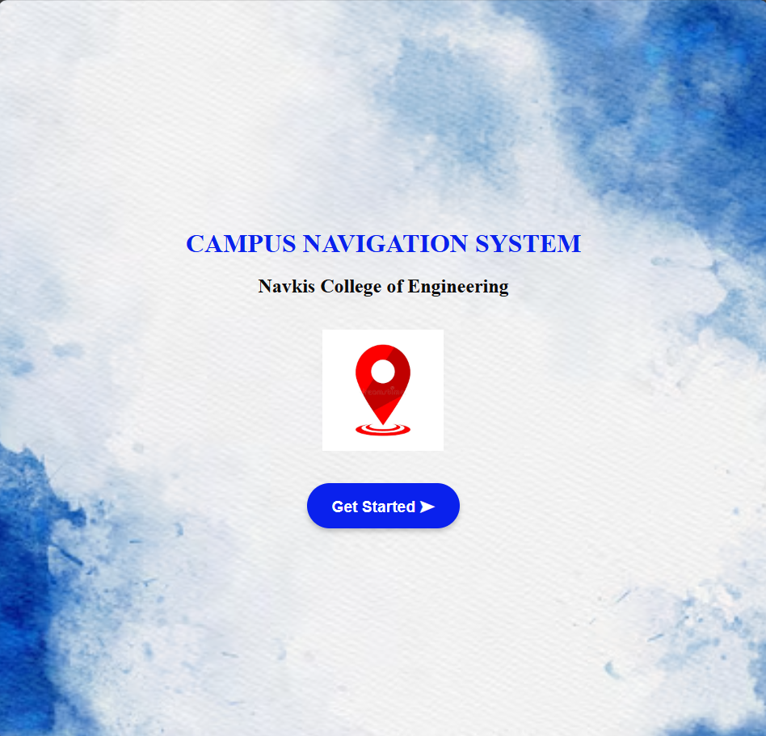
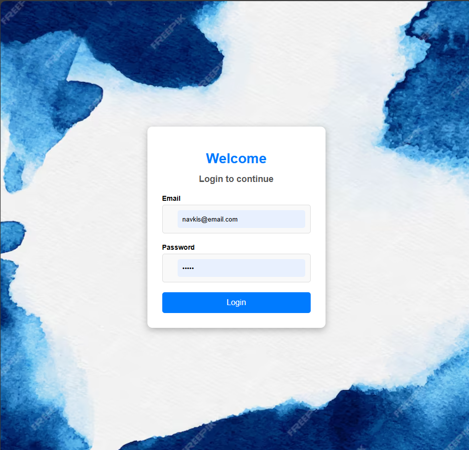
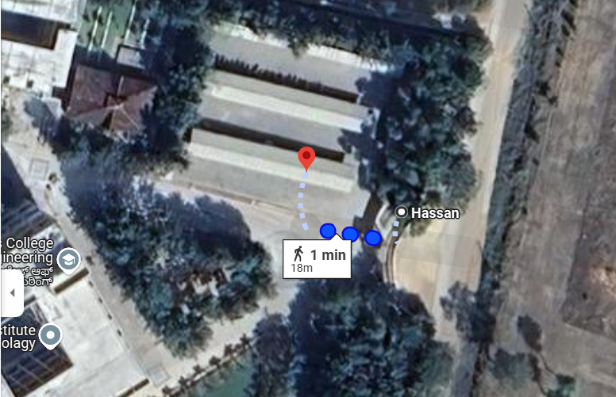

# 🚩 **Navkis Campus Navigation System**  

A **web-based navigation system** designed for **Navkis College of Engineering** to help students, faculty, and visitors find locations within the campus easily.  

---

## 📍 **Features**  
✅ **Location-based search** – Quickly find classrooms, library, cafeteria, offices, and HOD cabins.  
✅ **Google Maps Integration** – Get real-time directions and navigation assistance.  
✅ **User Authentication** – Secure **login system** for better access control.  
✅ **Interactive UI** – A simple, intuitive design that ensures a smooth user experience.  
✅ **Cross-device Compatibility** – Works seamlessly on mobile, tablet, and desktop.  

---

## 💻 **Technologies Used**  
- **Frontend:** HTML, CSS, JavaScript  
- **API:** Google Maps API for real-time navigation  

---

## 🛠️ **Output Screenshots**  

### 🚀 Get Started Page  
  

### 🔑 Login Page  
  

### 🗺️ Main Page Interface  
  

### 📍 Map Location  
  

---

## 👩‍💻 **Created By**  
👤 **Ayesha Siddiqa JH**  
📧 [Email](mailto:ayeshasiddiqajh422@gmail.com) | 🔗 [LinkedIn](https://www.linkedin.com/in/ayesha-siddiqa-j-h-1866ab334/) | 🖥️ [GitHub](https://github.com/Ayesha-Siddiqa-JH)  
